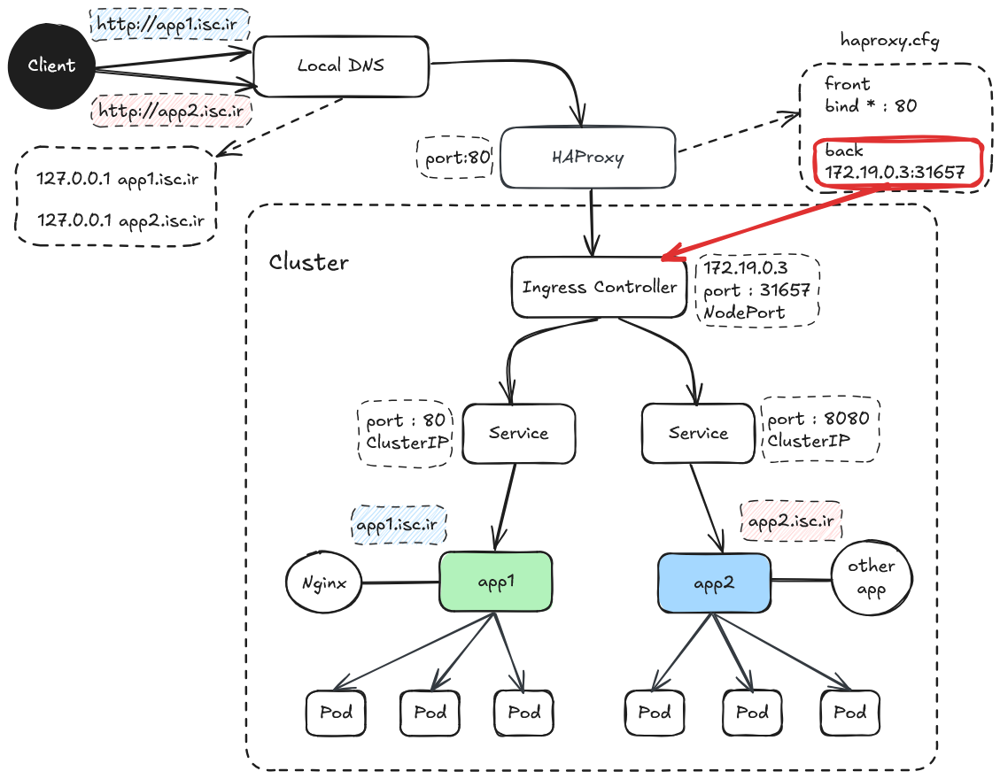

## Multi path Kubernetes with ingress nginx and HAProxy



## app1

```
---
  apiVersion: apps/v1
  kind: Deployment
  metadata:
    namespace: default
    name: app1
    labels:
      app: app1
  spec:
    replicas: 1
    selector:
      matchLabels:
        app: app1
    template:
      metadata:
        labels:
          app: app1
      spec:
        containers:
        - name: app1
          image: nginx:1.26.2-alpine
          ports:
          - containerPort: 80
---
apiVersion: v1
kind: Service
metadata:
  namespace: default
  name: app1-service
spec:
  type: NodePort
  selector:
    app: app1
  ports:
    - protocol: TCP
      port: 80
---
apiVersion: networking.k8s.io/v1
kind: Ingress
metadata:
  name: app1
  namespace: default
  annotations:
    kubernetes.io/ingress.class: "nginx"
spec:
  rules:
    - host: front.isc.ir
      http:
        paths:
          - path: /
            pathType: Prefix
            backend:
              service:
                name: app1-service
                port:
                  number: 80
```
## app2

```
---
  apiVersion: apps/v1
  kind: Deployment
  metadata:
    namespace: default
    name: app2
    labels:
      app: app2
  spec:
    replicas: 1
    selector:
      matchLabels:
        app: app2
    template:
      metadata:
        labels:
          app: app2
      spec:
        containers:
        - name: app2
          image: gcr.io/google-samples/hello-app:1.0
          ports:
          - containerPort: 8080
---
apiVersion: v1
kind: Service
metadata:
  namespace: default
  name: app2-service
spec:
  type: NodePort
  selector:
    app: app2
  ports:
    - protocol: TCP
      port: 8080
---
apiVersion: networking.k8s.io/v1
kind: Ingress
metadata:
  name: app2
  namespace: default
  annotations:
    kubernetes.io/ingress.class: "nginx"
spec:
  rules:
    - host: back.isc.ir
      http:
        paths:
          - path: /
            pathType: Prefix
            backend:
              service:
                name: app2-service
                port:
                  number: 8080
```
### Install the NGINX Ingress controller:
```
kubectl apply -f https://raw.githubusercontent.com/kubernetes/ingress-nginx/controller-v1.3.0/deploy/static/provider/cloud/deploy.yaml
```
### install helm:
```
curl https://baltocdn.com/helm/signing.asc | gpg --dearmor | sudo tee /usr/share/keyrings/helm.gpg > /dev/null
sudo apt-get install apt-transport-https --yes
echo "deb [arch=$(dpkg --print-architecture) signed-by=/usr/share/keyrings/helm.gpg] https://baltocdn.com/helm/stable/debian/ all main" | sudo tee /etc/apt/sources.list.d/helm-stable-debian.list
sudo apt-get update
sudo apt-get install helm
```
### install the NGINX Ingress controller with helm:
```
helm upgrade --install ingress-nginx ingress-nginx --repo https://kubernetes.github.io/ingress-nginx --namespace ingress-nginx --create-namespace --set controller.service.type=NodePort
```
### Run artifacts file:
```
kubectl apply -f sample1.yml
kubectl apply -f sample2.yml
```
### show information of cluster:
```
kubectl get all
```
### show pods:
```
kubectl get pods -o wide
```
### show services:
```
kubectl get svc -o wide
```
### show ingress:
```
kubectl get ing
```
### show services with ingress controller:
```
kubectl get svc -A
```
### show apps log:
```
kubectl logs -f app1-b97fbff76-cszq7
```
### show ingress log:
```
kubectl logs -f -n default ingress-nginx-controller-75bd8cf9d8-8j4pf
```
or:
```
kubectl logs -f -n ingress-nginx ingress-nginx-controller-75bd8cf9d8-8j4pf
```
### describe a pod:
```
kubectl describe pod app1
```
### delete artifact:
```
kubectl delete -f sample1.yml
```
### delete deployment:
```
kubectl delete deployment app1
```
### delete service:
```
kubectl delete svc app1-service
```
### delete ingress service:
```
kubectl delete ing ingress-example
```
### execute pod:
```
kubectl exec -it kubectl describe pod -- /bin/bash
```
## HAProxy
```
	sudo apt install haproxy
	cp /etc/haproxy/haproxy.cfg /etc/haproxy/haproxy.cfg.back
```
### haproxy config

### in this path:
```
vim /etc/haproxy/haproxy.cfg
```
### set below codes in haproxy.cfg:
```
	# Global settings
	global
	    log /dev/log local0
	    maxconn 2000
	
	# Default settings for frontend and backend
	defaults
	    log     global
	    option  httplog
	    timeout connect 5000ms
	    timeout client  50000ms
	    timeout server  50000ms
	
	# Frontend: listens on port 80 and routes traffic based on the host header
	frontend http-in
	    bind *:80  # Listens on port 80 for incoming HTTP requests
	    mode tcp
	    option tcplog
	    option tcp-check    # Route traffic based on the host in the HTTP request
	    default_backend front_backend
	
	# Backend for front.isc.ir
	backend front_backend
	    mode tcp
	    option tcplog
	    option tcp-check
	    # Forward traffic to localhost:31657 (where the front service is running)
	    server front-server 172.19.0.3:31657 check
```
### Restart haproxy service
```
systemctl restart haproxy.service
```
## change /etc/hosts
```
127.0.0.1 front.isc.ir
127.0.0.1 back.isc.ir
```
## Test URLs:
```
curl http://front.isc.ir
curl http://back.isc.ir
```


